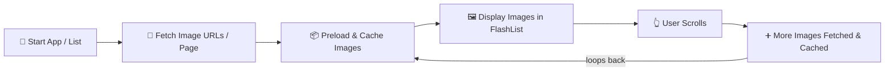
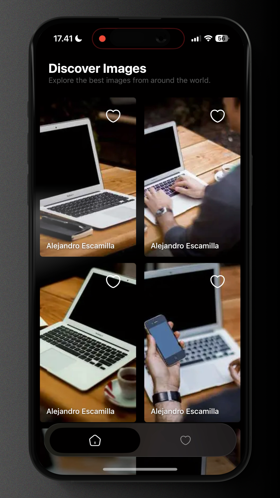

# Pikky 📸

A beautiful React Native image gallery app that lets you discover and save your favorite images from around the world.


## 🖼️ Image Caching & Preloading Flow

Pikky optimizes image loading and smooth scrolling using a two-pronged approach:

1. **Cache & Preload Images First**  
   - Images are preloaded from network using a cache-aware library (`@d11/react-native-fast-image`), so they're stored locally and ready to display when the user scrolls.
   - This reduces jank and improves performance, especially on slow networks.

2. **Efficient List Rendering with FlashList**  
   - `FlashList` (from `@shopify/flash-list`) is used to render image lists efficiently.
   - It only renders visible items plus a small buffer, minimizing memory and computation costs even for very large lists.

Below is a flowchart summarizing this process:

<!--
⚠️ Unable to render Mermaid diagram on GitHub due to HTML tags in node labels.
Diagram steps are listed below as plain text:
-->

**Image Caching & Preloading Flow:**

1. 🚀 **Start App / List**
2. 🔗 **Fetch Image URLs / Page**
3. 📦 **Preload & Cache Images** (`FastImage.preload`)
4. 🖼️ **Display Images in FlashList** (Fast, Low Memory)
5. 👆 **User Scrolls**
6. ➕ **More Images Fetched & Cached** (loops back to step 3)



> **TL;DR:**   
> Pikky preloads and caches images before displaying them in a performant infinite FlashList, resulting in fast, smooth, and seamless image gallery browsing.

## 🎬 Demo Video

Watch the iOS demo video to see Pikky in action:

### 📱 iOS & 🤖 Android Demos

<div align="center">
  <table>
    <tr>
      <td align="center">
        <a href="https://drive.google.com/file/d/10i4v6gDYkCaDv3nj1Z3BTdGbtRU_vaZ1/view?usp=sharing">
          <br />
          <b>iOS Demo</b>
        </a>
      </td>
      <td align="center">
        <a href="https://drive.google.com/file/d/YOUR_ANDROID_VIDEO_ID_HERE/view?usp=sharing">
          <br />
          <b>Android Demo</b>
        </a>
      </td>
    </tr>
  </table>
</div>

> 💡 Click an image above to watch the full demo video on Google Drive.

## ✨ Features

- 🖼️ **Image Discovery**: Browse beautiful images from Picsum Photos API
- ❤️ **Favorites**: Save your favorite images locally
- 📱 **Swipe Navigation**: Smooth swipe-based tab navigation
- 🔄 **Infinite Scroll**: Load more images as you scroll
- 🌐 **Network Detection**: Real-time network status detection with offline support
- 🎨 **Modern UI**: Beautiful gradient effects, blur effects, and smooth animations
- ⚡ **Performance**: Optimized with FlashList for smooth scrolling
- 🎯 **TypeScript**: Fully typed for better developer experience

## 📋 Prerequisites

Before you begin, ensure you have the following installed:

- **Node.js** >= 20 (check with `node --version`)
- **Yarn** or **npm** (package manager)
- **React Native CLI** (comes with React Native)
- **Xcode** (for iOS development on macOS)
- **Android Studio** (for Android development)
- **CocoaPods** (for iOS dependencies)

### iOS Additional Requirements

- macOS (required for iOS development)
- Xcode Command Line Tools: `xcode-select --install`
- CocoaPods: `sudo gem install cocoapods`

### Android Additional Requirements

- Java Development Kit (JDK) 17 or higher
- Android SDK (installed via Android Studio)
- Android Emulator or physical device

## 🚀 Getting Started

### 1. Clone the Repository

```bash
git clone <repository-url>
cd pikky
```

### 2. Install Dependencies

```bash
# Using Yarn (recommended)
yarn install

# OR using npm
npm install
```

### 3. iOS Setup

For iOS, you need to install CocoaPods dependencies:

```bash
# Navigate to iOS directory
cd ios

# Install CocoaPods dependencies
bundle exec pod install

# Return to root directory
cd ..
```

**Note**: If you don't have Bundler installed, first run:
```bash
bundle install
```

### 4. Start Metro Bundler

Start the Metro bundler in one terminal:

```bash
# Using Yarn
yarn start

# OR using npm
npm start
```

Metro will start on port 8081. Keep this terminal running.

### 5. Run the App

#### iOS

Open a new terminal and run:

```bash
# Using Yarn
yarn ios

# OR using npm
npm run ios
```

This will:
- Build the iOS app
- Launch the iOS Simulator
- Install and run the app

**Alternative**: Open `ios/pikky.xcworkspace` in Xcode and run from there.

#### Android

Make sure you have an Android emulator running or a device connected via USB with USB debugging enabled.

```bash
# Using Yarn
yarn android

# OR using npm
npm run android
```

This will:
- Build the Android app
- Install it on your emulator/device
- Launch the app

**Alternative**: Open `android` folder in Android Studio and run from there.

## 📱 Development

### Hot Reload

The app supports Fast Refresh. When you save changes:
- The app will automatically reload
- State is preserved (mostly)
- Changes appear instantly

### Manual Reload

- **iOS Simulator**: Press `R` twice or `Cmd + R`
- **Android**: Press `R` twice or `Ctrl + M` (Windows/Linux) / `Cmd + M` (macOS) to open Dev Menu, then select "Reload"

### Debugging

- **React Native Debugger**: Install React Native Debugger for advanced debugging
- **Chrome DevTools**: Shake device/emulator → "Debug" → Opens Chrome DevTools
- **Flipper**: For advanced debugging and network inspection

## 🏗️ Project Structure

```
pikky/
├── android/              # Android native code
├── ios/                  # iOS native code
├── src/
│   ├── components/       # Reusable UI components
│   │   ├── atoms/        # Basic components (buttons, text, etc.)
│   │   └── molecules/    # Composite components
│   ├── core/             # Core functionality
│   │   ├── api/          # API calls
│   │   └── http/         # HTTP client configuration
│   ├── hooks/            # Custom React hooks
│   ├── navigation/       # Navigation configuration
│   ├── pages/            # Screen components
│   │   ├── home/         # Home screen with image list
│   │   └── favorite/     # Favorites screen
│   └── services/         # Services and utilities
├── native/               # Custom native modules
│   └── toaster/          # Custom toaster module
├── public/               # Static assets
├── App.tsx               # Root component
└── package.json          # Dependencies and scripts
```

## 🛠️ Technologies Used

- **React Native** 0.83.1 - Mobile framework
- **React** 19.2.0 - UI library
- **TypeScript** - Type safety
- **React Navigation** - Navigation library
- **TanStack Query (React Query)** - Data fetching and caching
- **React Native Reanimated** - Smooth animations
- **FlashList** - High-performance list component
- **Axios** - HTTP client
- **MMKV** - Fast key-value storage
- **NetInfo** - Network status detection
- **Nitrogen** - Native module framework

## 📝 Available Scripts

```bash
# Start Metro bundler
yarn start

# Run on iOS
yarn ios

# Run on Android
yarn android

# Run linter
yarn lint

# Run tests
yarn test
```

Made with ❤️ by Jan Falih Fadhillah
